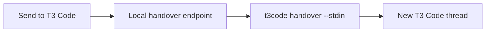

# @bvdm/t3code-cli

`t3code` hands the current folder or Git repository to a new thread in [T3 Code](https://github.com/pingdotgg/t3code).

It does not fake a handover by copying text or opening a generic app URL. It connects to the running local T3 server, resolves the workspace against T3 projects, optionally creates the missing project, creates a fresh thread, and starts its first prompt through T3's orchestration API.

## Install

Requirements: Node.js 22.16+ and T3 Code.

```bash
npm install --global @bvdm/t3code-cli
```

Then verify discovery and the active T3 server:

```bash
t3code --json doctor
```

## Develop locally

Requirements: Node.js 22.16+ and T3 Code.

```bash
pnpm install
pnpm check
pnpm build
npm link
```

Then verify the linked command:

```bash
t3code --json doctor
```

## Handover

From any folder in a repository:

```bash
t3code handover --prompt "Continue from this handover..."
```

When `--cwd` is omitted, the command starts from the process's current working directory. In the default `repo` workspace mode, that folder then resolves to its Git root.

For larger prompts, pass stdin so shell command-length and quoting rules do not matter:

```bash
printf '%s' "Continue from this handover..." | t3code handover --stdin
```

PowerShell:

```powershell
'Continue from this handover...' | t3code handover --stdin
```

The default behavior is:

- resolve the Git repository root (`workspaceMode: "repo"`);
- create a missing T3 project (`projectPolicy: "create"`);
- resolve T3's checkout preference in the same order as the installed app: project setting, checked-in `t3.json`, then the global setting;
- inherit an existing project's complete model selection, including its provider options;
- use full access for both the new thread and its first turn;
- create a fresh thread and start the prompt through T3's orchestration commands;
- reveal T3 Code after dispatch.

Use `--dry-run --json` to inspect the exact project and thread commands without writing T3 state.

Select the new thread's T3 controls on the handover command:

```bash
t3code handover \
  --provider codex \
  --model gpt-6-astra \
  --speed fast \
  --thinking-effort xhigh \
  --permission full-access \
  --mode build \
  --checkout current \
  --prompt "Continue from this handover..."
```

| Control | Values |
| --- | --- |
| `--provider` | A configured T3 provider instance id, such as `codex` or `claudeAgent` |
| `--model` | A model slug supported by that provider instance |
| `--speed`, `--speed-mode` | `standard`, `fast` |
| `--thinking-effort` | A model-supported value such as `low`, `medium`, `high`, `xhigh` or `max` |
| `--permission`, `--runtime-mode` | `approval-required`, `auto-accept-edits`, `full-access` |
| `--mode`, `--interaction-mode` | `build`/`default`, `plan` |
| `--checkout`, `--env-mode` | `current`/`local`, `worktree`, or T3's configured default via `t3` |

Command flags override the CLI config, which overrides the T3 project's saved model selection. Without either override, the saved selection and its options are passed through unchanged. A newly-created project uses the detected T3 version's default (`gpt-5.4` on 0.0.28 and `gpt-5.6-sol` on 0.0.29 and later).

Speed and thinking effort are stored as model options. T3 applies the option ids supported by the selected provider/model. If `--provider` changes the project's default provider instance, also pass `--model` because provider instance ids can be user-defined and do not imply a model.

## Settings

```bash
t3code config show
t3code config set projectPolicy existing
t3code config set workspaceMode folder
t3code config set openMode browser
t3code config set threadEnvMode local
t3code config set provider codex
t3code config set model gpt-5.6-sol
t3code config set speedMode fast
t3code config set thinkingEffort xhigh
```

| Setting | Values | Default |
| --- | --- | --- |
| `projectPolicy` | `create`, `existing` | `create` |
| `workspaceMode` | `repo`, `folder` | `repo` |
| `openMode` | `auto`, `desktop`, `browser`, `none` | `auto` |
| `threadEnvMode` | `t3`, `local`, `worktree` | `t3` |
| `runtimeMode` | `approval-required`, `auto-accept-edits`, `full-access` | `full-access` |
| `interactionMode` | `default`, `plan` | `default` |
| `provider` | Configured T3 provider instance id | T3 project selection |
| `model` | Provider model slug | T3 project selection |
| `speedMode` | `standard`, `fast` | T3 project selection |
| `thinkingEffort` | Model-supported effort value | T3 project selection |

`projectPolicy: "existing"` makes a missing project a hard error. `workspaceMode: "folder"` uses the exact current folder instead of walking up to the Git root. `threadEnvMode: "t3"` follows T3's project → `t3.json` → global local/worktree preference. Explicit CLI config values remain overrides.

T3 0.0.28 and later expose an atomic thread bootstrap contract for new worktrees. `--checkout worktree` uses it to create the thread, prepare the worktree from the current branch, run the matching setup script, and start the prompt. Worktree creation honors the current installation's explicit `newWorktreesStartFromOrigin` value; when that value is absent, it uses the installed version's default (`false` on 0.0.28, `true` on 0.0.29 and later). A repository without a current branch returns `WORKTREE_REQUIRES_BRANCH` instead of silently falling back to the current checkout.

## Commands

```text
t3code --json doctor
t3code config path|show|set
t3code projects list
t3code projects resolve --cwd .
t3code projects ensure --cwd . --project-policy create
t3code threads create --stdin
t3code handover --stdin
t3code request get /api/orchestration/snapshot
```

Every command supports human-readable output. `--json` produces `{ "ok": true, "data": ... }` on success and a stable error envelope on failure.

## Origin and optional UI example

This CLI was initially developed for the [Delano viewer](https://github.com/MajesteitBart/delano). Delano's **Send to T3 Code** button lets someone hand browser context directly to a new thread in the T3 Code chat application.




The CLI is the product; a front end is not required. See the optional [integration README](integrations/README.md#why-delano-needed-it) for why Delano needed this handover button and how its browser-to-server-to-CLI flow works. That folder also contains a copyable React split button and Node bridge as one example of integrating `t3code` into another application.

## Desktop navigation

Current stable T3 Code registers `t3code://` but only uses a second launch to reveal its window. The CLI therefore creates the exact thread first and reports `opened.exactThread: false` when it can only reveal today's desktop app. If a T3 build registers the proposed `t3://thread/<threadId>` protocol, `openMode: "auto"` uses it and reports `exactThread: true`. `openMode: "browser"` opens the exact local web route immediately.

## Security

The CLI uses T3's own `auth session issue` control plane to mint an administrative bearer token, keeps it only in memory, and revokes it in a `finally` block. Tokens are never included in JSON output or logs.

## Publish a release

Pull requests and pushes run `pnpm check` through [GitHub Actions](.github/workflows/ci.yml) on the minimum supported Node 22 and Node 24 versions.

Publishing uses npm trusted publishing from [publish.yml](.github/workflows/publish.yml). Configure the package's **Trusted Publisher** once in the npm package settings:

| Field | Value |
| --- | --- |
| Provider | GitHub Actions |
| Organization or user | `MajesteitBart` |
| Repository | `t3code-cli` |
| Workflow filename | `publish.yml` |
| Environment | Leave empty |

The workflow uses short-lived OIDC credentials, so it does not need an `NPM_TOKEN` repository secret. It also publishes npm provenance automatically.

To release a new version:

```bash
npm version patch
git push --follow-tags
```

Then publish a GitHub Release for the new `v<package-version>` tag. The workflow verifies that the tag matches `package.json`, installs from the frozen lockfile, runs the complete `prepublishOnly` check, and publishes the public scoped package to npm.
